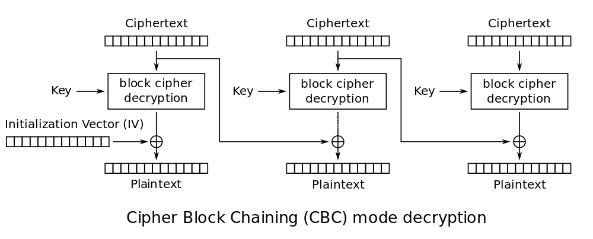
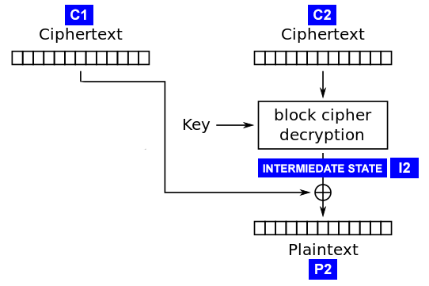

# Padding Oracle Attack

## 原理阐述

### Padding
在密码学中，由于底层加密算法往往是针对固定长度的块来设计的（例如 AES 的 CBC 模式的块大小为 16），所以在对可变长度的明文进行加密时，一般需要额外增加 padding 字段来满足块对齐以便进行加密。

Padding 方法可能有多种，为简单起见，这里只讨论常用的 PKCS7Padding 方法。在 PKCS7Padding 方法中，padding 字段填充的每个字节的值都是相同的，其值均为需要填充的字节个数，例如：如果块大小是 16， 那么明文 "aaaa" 的 padding 就是 [12]*12。如果明文长度刚好是块大小的整数倍，则需要额外加上一个块的 padding，即 [16]*16 。

PKCS7Padding 的 Python 实现代码如下：

```python
def pkcs7padding(plaintext):
    bs = 16
    padding_len = bs - len(plaintext) % bs
    return plaintext + padding_len * chr(padding_len)
```

### Padding Oracle
指被攻击对象暴露的一个接口，该接口可以通过任意形式提供，例如可能是命令行，可能是API，也可能是 REST 接口等等。形式不重要，重要的是内容，该接口可以输入密文，返回该段密文解密后的 Padding 是否正确。如果解密相关的应用开发者不小心，很有可能会暴露出该类接口（例如在提供 web 服务时，后端解密代码未对 Padding 异常情况进行捕捉，导致 HTTP 500 错误）。

Padding Oracle Attack 就是利用 Padding Oracle 来进行攻击的，简单来说，攻击者首先需要窃取一段密文，其次要有一个 Padding Oracle 可供利用，然后攻击者便可通过重复修改密文并发送到 Padding Oracle 的方式，来对这段密文进行破解。

### XOR（异或）
在解释下一个概念之前，先让我们稍微复习下 XOR（异或）操作。下面是 XOR 的一些基本公式：

```
  A ⊕ A = 0
  A ⊕ 0 = A
  A ⊕ B = B ⊕ A
  (A ⊕ B) ⊕ C = A ⊕ (B ⊕ C)
  ∴ A ⊕ B ⊕ B = A ⊕ (B ⊕ B) = A ⊕ 0 = A
```

### Cipher-Block Chaining (CBC)
本文将阐述针对 AES CBC 模式的 Padding Oracle Attack，因此，有必要先解释下 CBC 模式的工作过程。

顾名思义，CBC 是针对块的加密，而且块与块之间是存在链式关系的（这种链式关系你很快就会理解了）。

#### 加密过程

在 CBC 中，有一个名叫 "block cipher"的东西，这个 "block cipher" 接受『块』作为输入，密文作为输出。本文不涉及 "block cipher" 的具体工作原理，我们可以把 "block cipher" 当作黑盒子来处理。

在 CBC 加密过程中，每个 "plaintext block" 在送入 "block cipher" 前，都需要先和它前面的 "ciphertext block" (即前面相邻的已加密的密文块) 进行 XOR 操作，XOR 的结果再送入 "block cipher"进行加密处理。这意味着每个加密出来的密文块都依赖于前面的明文加密后的结果，因此改变每一个明文字符都会对后面的加密结果产生巨大影响。这是一种被推荐的、比较安全的加密模式。



(from [Wikipedia](https://en.wikipedia.org/wiki/Block_cipher_mode_of_operation#Cipher-block_chaining_.28CBC.29) )

#### 解密过程

类似的，在解密过程中，有一个 "block cipher decryption"，这个东东接受『密文块』作为输入，但输出不是明文，是一个中间结果。结合上面加密的过程，我们不难理解，这个中间结果就是明文在和 previous cipher block 异或之后的结果。拿到这个中间结果后，跟进前面异或公式的最后一条可知，只需将该中间结果和 previous cipher block 再做一次异或，即可得到最初的明文块。至此，该 block 解密结束。如果是第一个 cipher block，则将中间结果和 IV 进行一次异或即可得到明文块。当然，如果是最后一个 block，还需要根据 PKCS7Padding 的规则将尾部 Padding 剔除，剔除 Padding 的 Python 实现代码如下：

```python
def pkcs7unpadding(plaintext):
    padding_len = ord(plaintext[-1])
    # check if the padding_len is valid
    # ...
    return plaintext[:-padding_len]
```



(from [Rob Heaton's blog](http://robertheaton.com/2013/07/29/padding-oracle-attack/) )

